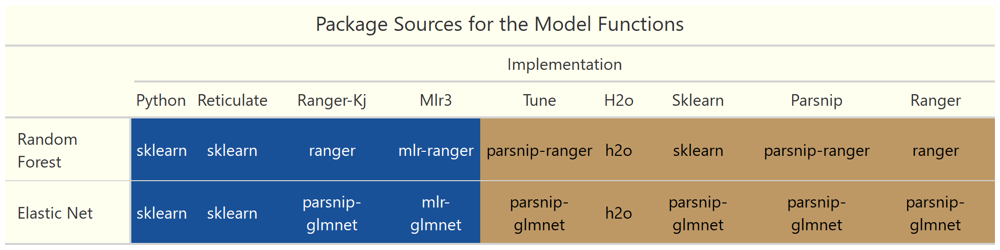

# Nested Cross-Validation: Comparing Methods and Implementations  
### (In-progress)

Nested cross-validation has become a recommended technique for situations in which the size of our dataset is insufficient to simultaneously handle hyperparameter tuning and algorithm comparison. Examples of such situations include: proof of concept, start-ups, medical studies, time series, etc. Using standard methods such as k-fold cross-validation in these cases may result in  significant increases in optimization bias. Nested cross-validation has been shown to produce low bias, out-of-sample error estimates even using datasets with only hundreds of rows and therefore gives a better judgement of generalization performance.  

The primary issue with this technique is that it is computationally very expensive with potentially tens of 1000s of models being trained during the process. While researching this technique, I found two slightly different methods of performing nested cross-validation — one authored by [Sabastian Raschka](https://github.com/rasbt/stat479-machine-learning-fs19/blob/master/11_eval4-algo/code/11-eval4-algo__nested-cv_verbose1.ipynb) and the other by [Max Kuhn and Kjell Johnson](https://tidymodels.github.io/rsample/articles/Applications/Nested_Resampling.html).  
I'll be examining two aspects of nested cross-validation:  

1. Duration: Which packages and functions give us the fastest implementation of each method?  
2. Performance: First, develop a testing framework. Then, using a generated dataset, find how many repeats, given the number of samples, should we expect to need in order to obtain a reasonably accurate out-of-sample error estimate.  

With regards to the question of speed, I'll will be testing implementations of both methods from various packages which include {tune}, {mlr3}, {h2o}, and {sklearn}.  


## Duration Experiment
Experiment details:  
   
   * Random Forest and Elastic Net Regression algorithms  
   * Both with 100x2 hyperparameter grids  
   * Kuhn-Johnson  
      + 100 observations  10 features, numeric target variable  
      + outer loop: 2 repeats, 10 folds  
      + inner loop: 25 bootstrap resamples  
   * Raschka  
      + 5000 observations: 10 features, numeric target variable  
      + outer loop: 5 folds  
      + inner loop: 2 folds  

(Size of the data sets are the same as those in the original scripts by the authors)  


Various elements of the technique can be altered to improve performance. These include:  

1. Hyperparameter value grids  
2. Outer-Loop CV strategy  
3. Inner-Loop CV strategy  
4. Grid search strategy  

These elements also affect the run times. Both methods will be using the same size grids, but Kuhn-Johnson uses repeats and more folds in the outer and inner loops while Raschka's trains an extra model over the entire training set at the end at the end. Using Kuhn-Johnson, 50,000 models will be trained for each algorithm — using Raschka's, 1,001 models.  

MLFlow was used to keep track of the duration (seconds) of each run along with the implementation and method used. I've used implementation to describe the various changes in coding structures that accompanies using each package's functions. A couple examples are the python for-loop being replaced with a while-loop and `iter_next` function when using {reticulate} and {mlr3} entirely using R's R6 Object Oriented Programming system.   

  

  

```{r, echo=FALSE, message=FALSE}
pacman::p_load(extrafont, dplyr, ggplot2, patchwork, stringr, tidytext)


runs_raw <- readr::read_rds("data/duration-runs.rds")


runs <- runs_raw %>%
      mutate(duration = round(duration/60, 2),
             implementation = as.factor(str_to_title(implementation)),
             implementation = reorder_within(implementation, duration, method))


raschka <- runs %>% 
   filter(method == "raschka") %>%
   ggplot(aes(y = duration, x = implementation, label = duration)) + 
   geom_bar(aes(color = after_scale(prismatic::clr_darken(rep("#195198",4), 0.3))), fill = "#195198", stat = "identity", width = 0.50) +
   coord_flip() +
   scale_x_reordered() +
   geom_text(hjust = 1.3,  size = 3.5, color = "white") +
   labs(x = NULL, y = NULL,
        title = "Raschka") +
   theme(plot.title = element_text(size = rel(0.9)))


kj <- runs %>% 
   filter(method == "kj") %>%
   ggplot(aes(y = duration, x = implementation, label = duration)) + 
   geom_bar(aes(color = after_scale(prismatic::clr_darken(rep("#BD9865",5), 0.3))), stat = "identity", width = 0.50, fill = "#BD9865") +
   coord_flip() +
   scale_x_reordered() +
   geom_text(hjust = 1.3,  size = 3.5, color = "white") +
   labs(x = NULL, y = NULL,
        title = "Kuhn-Johnson") +
   theme(plot.title = element_text(size = rel(0.9)))

durations <- raschka + kj +
      plot_annotation(title = "Durations",
                      subtitle = "minutes") &
      theme(text = element_text(family = "Roboto"),
            axis.ticks = element_blank(),
            axis.text.x = element_blank(),
            panel.background = element_rect(fill = "ivory",
                                            colour = "ivory"),
            plot.background = element_rect(fill = "ivory"),
            plot.subtitle = element_text(size = rel(0.85)),
            panel.border = element_blank(),
            panel.grid.major = element_blank(),
            panel.grid.minor = element_blank()
      )
durations


```


## Performance Experiment  

Experiment details:  

  * The fastest implementation of each method will be used in running a nested cross-validation with different sizes of data ranging from 100 to 5000 observations and different numbers of repeats of the outer-loop cv strategy.  
      * The {mlr3} implementation was the fastest for Raschka's method, but the Ranger-Kuhn-Johnson implementation was close. To simplify, I'll be using Ranger-Kuhn-Johnson for both methods.  
  * The chosen algorithm and hyperparameters will used to predict on a 100K row simulated dataset and the mean absolute error will be calculated for each combination of repeat, data size, and method.  
  * Runtimes began to explode after n = 800 for my 8 vcpu, 16 GB RAM desktop, therefore I ran this experiment using AWS instances: a r5.2xlarge for the Elastic Net and a r5.24xlarge for Random Forest.  
  * I'll be transitioning from imperative scripts to a functional approach, because I'm iterating through different numbers of repeats and sample sizes. Given the long runtimes and impermanent nature of my internet connection, it would also be nice to cache each iteration as it finishes. The [{drake}](https://github.com/ropensci/drake) package is superb on both counts, so I'm using it to orchestrate.  

```{r perf_build_times, echo=FALSE, message=FALSE, cache=TRUE}

pacman::p_load(extrafont,dplyr, purrr, lubridate, ggplot2, drake)
bt <- build_times(starts_with("ncv_results"), digits = 4)

subtarget_bts <- bt %>% 
      filter(stringr::str_detect(target, pattern = "[0-9]_([0-9]|[a-z])")) %>% 
      select(target, elapsed)

subtargets_raw <- map_dfr(subtarget_bts$target, function(x) {
      results <- readd(x, character_only = TRUE) %>% 
            mutate(subtarget = x) %>% 
            select(subtarget, everything())
      
}) %>% 
      inner_join(subtarget_bts, by = c("subtarget" = "target"))

subtargets <- subtargets_raw %>% 
      mutate(repeats = factor(repeats),
             n = factor(n),
             elapsed = round(as.numeric(elapsed)/3600, 2))

```

```{r perf_bt_charts, echo=FALSE, message=FALSE}

fill_colors <- unname(swatches::read_ase("palettes/Forest Floor.ase"))

ggplot(subtargets, aes(y = elapsed, x = repeats,
                       fill = n, label = elapsed)) +
   geom_col(position = position_dodge(width = 0.85)) +
   scale_fill_manual(values = fill_colors[4:7]) +
   geom_text(hjust = 1.3,  size = 3.5,
             color = "white", position = position_dodge(width = 0.85)) +
   coord_flip() +
   labs(y = "Runtime (hrs)", x = "Repeats",
        title = "Kuhn-Johnson", fill = "Sample Size") +
   theme(title = element_text(family = "Roboto"),
         text = element_text(family = "Roboto"),
         legend.position = "top",
         legend.background = element_rect(fill = "ivory"),
         legend.key = element_rect(fill = "ivory"),
         axis.ticks = element_blank(),
         axis.text.x = element_blank(),
         panel.background = element_rect(fill = "ivory",
                                         colour = "ivory"),
         plot.background = element_rect(fill = "ivory"),
         panel.border = element_blank(),
         panel.grid.major = element_blank(),
         panel.grid.minor = element_blank()
   )

```


References  

Boulesteix, AL, and C Strobl. 2009. “Optimal Classifier Selection and Negative Bias in Error Rate Estimation: An Empirical Study on High-Dimensional Prediction.” BMC Medical Research Methodology 9 (1): 85. [link](https://www.researchgate.net/publication/40756303_Optimal_classifier_selection_and_negative_bias_in_error_rate_estimation_An_empirical_study_on_high-dimensional_prediction)  

Sabastian Raschka, "STAT 479 Statistical Tests and Algorithm Comparison," (Lecture Notes, University of Wisconsin-Madison, Fall 2019). [link](https://github.com/rasbt/stat479-machine-learning-fs19/blob/master/11_eval4-algo/11-eval4-algo__notes.pdf)  

Sudhir Varma and Richard Simon. "Bias in error estimation when using cross-validation for model selection". In: BMC bioinformatics 7.1 (2006). p. 91. [link](https://bmcbioinformatics.biomedcentral.com/articles/10.1186/1471-2105-7-91)  


