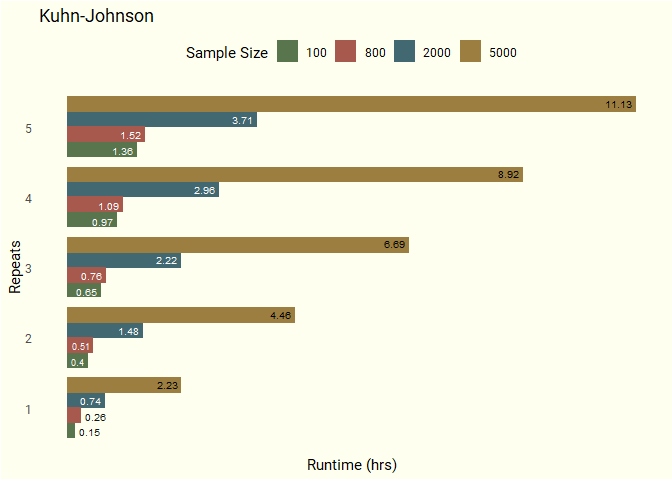
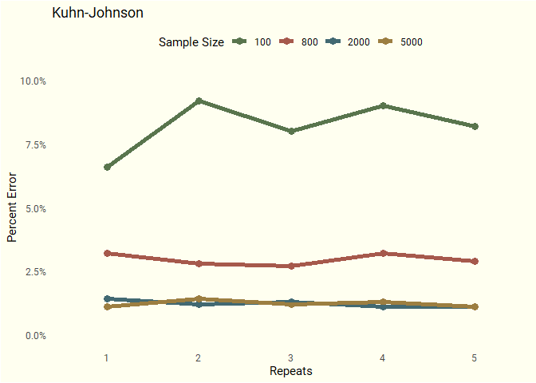

# Nested Cross-Validation: Comparing Methods and Implementations

### (In-progress)

Nested cross-validation has become a recommended technique for
situations in which the size of our dataset is insufficient to
simultaneously handle hyperparameter tuning and algorithm comparison.
Examples of such situations include: proof of concept, start-ups,
medical studies, time series, etc. Using standard methods such as k-fold
cross-validation in these cases may result in substantial increases in
optimization bias. Nested cross-validation has been shown to produce
less biased, out-of-sample error estimates even using datasets with only
hundreds of rows and therefore gives a better judgement of
generalization performance.

The primary issue with this technique is that it is computationally very
expensive with potentially tens of 1000s of models being trained during
the process. While researching this technique, I found two slightly
different methods of performing nested cross-validation — one authored
by [Sabastian
Raschka](https://github.com/rasbt/stat479-machine-learning-fs19/blob/master/11_eval4-algo/code/11-eval4-algo__nested-cv_verbose1.ipynb)
and the other by [Max Kuhn and Kjell
Johnson](https://tidymodels.github.io/rsample/articles/Applications/Nested_Resampling.html).  
I’ll be examining two aspects of nested cross-validation:

1.  Duration: Find out which packages and combinations of model
    functions give us the fastest implementation of each method.  
2.  Performance: First, develop a testing framework. Then, using a
    generated dataset, calculate how many repeats, given the sample
    size, should we expect to need in order to obtain a reasonably
    accurate out-of-sample error estimate.

## Duration Experiment

##### Experiment details:

  - Random Forest and Elastic Net Regression algorithms  
  - Both with 100x2 hyperparameter grids  
  - Kuhn-Johnson
      - 100 observations 10 features, numeric target variable  
      - outer loop: 2 repeats, 10 folds  
      - inner loop: 25 bootstrap resamples  
  - Raschka
      - 5000 observations: 10 features, numeric target variable  
      - outer loop: 5 folds  
      - inner loop: 2 folds

(Size of the data sets are the same as those in the original scripts by
the authors)

Various elements of the technique can be altered to improve performance.
These include:

1.  Hyperparameter value grids  
2.  Outer-Loop CV strategy  
3.  Inner-Loop CV strategy  
4.  Grid search strategy

These elements also affect the run times. Both methods will be using the
same size grids, but Kuhn-Johnson uses repeats and more folds in the
outer and inner loops while Raschka’s trains an extra model over the
entire training set at the end at the end. Using Kuhn-Johnson, 50,000
models (grid size \* number of repeats \* number of folds in the
outer-loop \* number of folds/resamples in the inner-loop) will be
trained for each algorithm — using Raschka’s, 1,001 models.

[MLFlow](https://mlflow.org/docs/latest/index.html) was used to keep
track of the duration (seconds) of each run along with the
implementation and method used. I’ve used “implementation” to
encapsulate not only the combinations of various model functions, but
also, to describe the various changes in coding structures that
accompanies using each package’s functions, i.e. I can’t just
plug-and-play different packages’ model functions into the same script.

<!-- -->

## Performance Experiment

##### Experiment details:

  - The fastest implementation of each method was used in running a
    nested cross-validation with different sizes of data ranging from
    100 to 5000 observations and different numbers of repeats of the
    outer-loop cv strategy.
      - The {mlr3} implementation was the fastest for Raschka’s method,
        but the Ranger-Kuhn-Johnson implementation was close. To
        simplify, I’ll be using
        [Ranger-Kuhn-Johnson](https://github.com/ercbk/nested-cross-validation-comparison/blob/master/duration-experiment/kuhn-johnson/nested-cv-ranger-kj.R)
        for both methods.  
  - The chosen algorithm and hyperparameters was used to predict on a
    100K row simulated dataset.  
  - The percent error between the the average mean absolute error (MAE)
    across the outer-loop folds and the MAE of the predictions on this
    100K dataset was calculated for each combination of repeat, data
    size, and method.  
  - To make this experiment manageable in terms of runtimes, I used AWS
    instances: a r5.2xlarge for the Elastic Net and a r5.24xlarge for
    Random Forest.  
  - Iterating through different numbers of repeats, sample sizes, and
    methods makes a functional approach more appropriate than running
    imperative scripts. Also, given the long runtimes and impermanent
    nature of my internet connection, it would also be nice to cache
    each iteration as it finishes. The
    [{drake}](https://github.com/ropensci/drake) package is superb on
    both counts, so I’m used it to orchestrate.

<!-- -->

<!-- -->

##### Results:

Kuhn-Johnson:

  - Runtimes for n = 100 and n = 800 are close, and there’s a large jump
    in runtime going from n = 2000 to n = 5000.  
  - The number of repeats had little effect on the amount of percent
    error.
  - For n = 100, there is substantially more variation in percent error
    than in the other sample sizes.  
  - While there is a large runtime cost that comes with increasing the
    sample size from 2000 to 5000 obsservations, it doesn’t seem to
    provide any benefit in gaining a more accurate estimate of the
    out-of-sample error.

References

Boulesteix, AL, and C Strobl. 2009. “Optimal Classifier Selection and
Negative Bias in Error Rate Estimation: An Empirical Study on
High-Dimensional Prediction.” BMC Medical Research Methodology 9 (1):
85.
[link](https://www.researchgate.net/publication/40756303_Optimal_classifier_selection_and_negative_bias_in_error_rate_estimation_An_empirical_study_on_high-dimensional_prediction)

Sabastian Raschka, “STAT 479 Statistical Tests and Algorithm
Comparison,” (Lecture Notes, University of Wisconsin-Madison, Fall
2019).
[link](https://github.com/rasbt/stat479-machine-learning-fs19/blob/master/11_eval4-algo/11-eval4-algo__notes.pdf)

Sudhir Varma and Richard Simon. “Bias in error estimation when using
cross-validation for model selection”. In: BMC bioinformatics 7.1
(2006). p. 91.
[link](https://bmcbioinformatics.biomedcentral.com/articles/10.1186/1471-2105-7-91)
