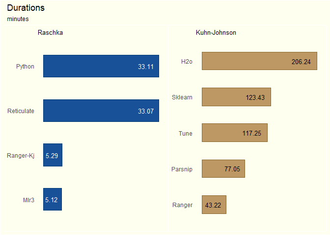
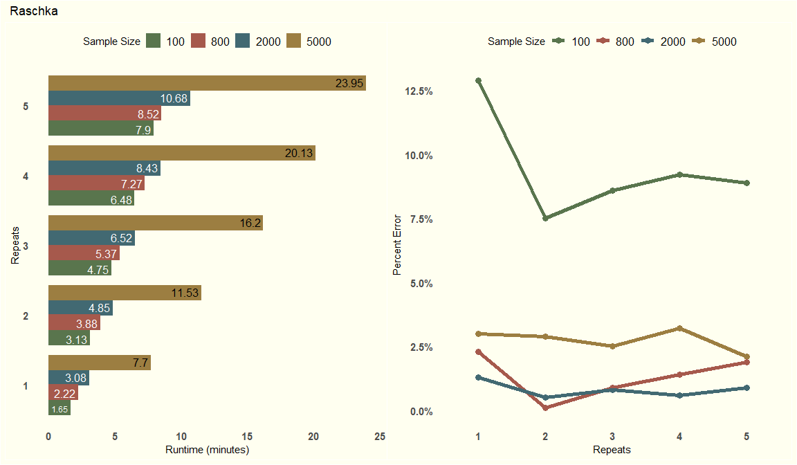

# Nested Cross-Validation: Comparing Methods and Implementations

  

Experiments conducted in May 2020. Packages in renv.lock had to be
updated in August 2021, but all scripts haven’t been re-ran to make sure
everything still works. So, some refactoring of code may be necessary in
order to reproduce results.

Nested cross-validation (or double cross-validaation) has become a
recommended technique for situations in which the size of our dataset is
insufficient to simultaneously handle hyperparameter tuning and
algorithm comparison. Using standard methods such as k-fold
cross-validation in these cases may result in substantial increases in
optimization bias where the more models that are trained on a fold means
there’s a greater opportunity for a model to achieve a low score by
chance. Nested cross-validation has been shown to produce less biased,
out-of-sample error estimates even using datasets with only hundreds of
rows and therefore gives a better estimation of generalized performance.
The primary issue with this technique is that it is usually
computationally expensive with potentially tens of 1000s of models being
trained during the process.

While researching this technique, I found two slightly different
variations of performing nested cross-validation — one authored by
[Sabastian
Raschka](https://github.com/rasbt/stat479-machine-learning-fs19/blob/master/11_eval4-algo/code/11-eval4-algo__nested-cv_verbose1.ipynb)
and the other by [Max Kuhn and Kjell
Johnson](https://www.tidymodels.org/learn/work/nested-resampling/).
After the nested cross-validation procedure and an algorithm is chosen,
Raschka performs an extra k-fold cross-validation using the inner-loop
cv strategy on the entire training set in order to tune his final model.
Therefore, the hyperparameter tuning that takes place in the inner-loop
during nested cross-validation is only in service of algorithm
selection. Kuhn-Johnson uses majority vote. Whichever set of
hyperparameter values has been chosen during the inner-loop tuning
procedure the most often is the set used to fit the final model. The
other diffferences are just the number of folds/resamples used in the
outer and inner loops which are essentially just tuning parameters.

Various elements of the technique affect the run times and performance.
These include:

1.  Hyperparameter value grids  
2.  Grid search strategy  
3.  Inner-Loop CV strategy  
4.  Outer-Loop CV strategy

I’ll be examining two aspects of nested cross-validation:

1.  Duration: Find out which packages and combinations of model
    functions give us the fastest implementation of each method.  
2.  Performance: First, develop a testing framework. Then, for a given
    data generating process, determine how large of sample size is
    needed to obtain reasonably accurate out-of-sample error estimate.
    Also, determine how many repeats in the outer-loop cv strategy
    should be used to calculate this error estimate.

The results from these experiments should give us an idea about which
methodology, model packages, and compute specifications will produce
lower training times, lower costs, and lower generalization error.

## Recommendations:

-   For faster training times, use {mlr3} or other R model packages
    outside of the {tidymodels} ecosystem and code the nested
    cross-validation loops manually (Code:
    [mlr3](https://github.com/ercbk/nested-cross-validation-comparison/blob/master/duration-experiment/raschka/nested-cv-mlr3-raschka.R),
    [ranger-kj](https://github.com/ercbk/nested-cross-validation-comparison/blob/master/duration-experiment/kuhn-johnson/nested-cv-ranger-kj.R),
    [Kuhn-Johnson](https://www.tidymodels.org/learn/work/nested-resampling/)).  
-   Choose compute resources with large amounts of RAM instead of opting
    for powerful processors. From the AWS cpu product line, I found the
    r5.\#xlarge instances ran fastest. The most efficient number of
    vCPUs may vary according to the algorithm.  
-   For the data in this experiment with row numbers in the low
    thousands, Raschka’s method performed just as well as Kuhn-Johnson’s
    but was substantially faster.  
-   For the data in this experiment with row numbers in the hundreds,
    Raschka’s method with at least 3 repeats performed just as well as
    Kuhn-Johnson’s but was still substantially faster even with the
    repeats.

## Duration

#### Experiment details:

-   Random Forest and Elastic Net Regression algorithms  
-   Both algorithms are tuned with 100x2 hyperparameter grids using a
    latin hypercube design.  
-   From {mlbench}, I’m using the generated data set, friedman1, from
    Friedman’s Multivariate Adaptive Regression Splines (MARS) paper.
-   Kuhn-Johnson
    -   100 observations: 10 features, numeric target variable  
    -   outer loop: 2 repeats, 10 folds  
    -   inner loop: 25 bootstrap resamples  
-   Raschka
    -   5000 observations: 10 features, numeric target variable  
    -   outer loop: 5 folds  
    -   inner loop: 2 folds

The sizes of the data sets are the same as those in the original scripts
by the authors. Using Kuhn-Johnson, 50,000 models (grid size \* number
of repeats \* number of folds in the outer-loop \* number of
folds/resamples in the inner-loop) are trained for each algorithm —
using Raschka’s, 1,001 models for each algorithm. The one extra model in
the Raschka variation is due to his method of choosing the
hyperparameter values for the final model.

[MLFlow](https://mlflow.org/docs/latest/index.html) is used to keep
track of the duration (seconds) of each run along with the
implementation and method used.

<!-- -->

#### Duration Results:

-   For the Raschka method, the {mlr3} comes in first with
    {ranger}/{parsnip} coming in a close second.  
-   For the Kuhn-Johnson method, {ranger}/{parsnip} is clearly
    fastest.  
-   This was my first time using the {reticulate} package, and I wanted
    to see if there was any speed penalty for using its api instead of
    just running a straight Python script. There doesn’t appear to be
    any.  
-   {h2o} and {sklearn} are surprisingly slow. If the data size were
    larger, I think {h2o} would be more competitive.  
-   The {tidymodels} packages, {parsnip} and {tune}, add substantial
    overhead.

## Performance

#### Experiment details:

-   The same data, algorithms, and hyperparameter grids are used.
-   The fastest implementation of each method is used in running a
    nested cross-validation with different sizes of data ranging from
    100 to 5000 observations and different numbers of repeats of the
    outer-loop cv strategy.
    -   The {mlr3} implementation is the fastest for Raschka’s method,
        but the Ranger-Kuhn-Johnson implementation is close. To
        simplify, I am using
        [Ranger-Kuhn-Johnson](https://github.com/ercbk/nested-cross-validation-comparison/blob/master/duration-experiment/kuhn-johnson/nested-cv-ranger-kj.R)
        for both methods.  
-   The chosen algorithm with hyperparameters is fit on the entire
    training set, and the resulting final model predicts on a 100K row
    Friedman dataset.  
-   The percent error between the the average mean absolute error (MAE)
    across the outer-loop folds and the MAE of the predictions on this
    100K dataset is calculated for each combination of repeat, data
    size, and method.  
-   To make this experiment manageable in terms of runtimes, I am using
    AWS instances: a r5.2xlarge for the Elastic Net and a r5.24xlarge
    for Random Forest.
    -   Also see the Discussion section  
-   Iterating through different numbers of repeats, sample sizes, and
    methods makes a functional approach more appropriate than running
    imperative scripts. Also, given the long runtimes and impermanent
    nature of my internet connection, it would also be nice to cache
    each iteration as it finishes. The
    [{drake}](https://github.com/ropensci/drake) package is superb on
    both counts, so I’m using it to orchestrate.

<!-- -->

#### Performance Results (Kuhn-Johnson):

-   Runtimes for n = 100 and n = 800 are close, and there’s a large jump
    in runtime going from n = 2000 to n = 5000.  
-   The number of repeats has little effect on the amount of percent
    error.
-   For n = 100, there is substantially more variation in percent error
    than in the other sample sizes.  
-   While there is a large runtime cost that comes with increasing the
    sample size from 2000 to 5000 observations, it doesn’t seem to
    provide any benefit in gaining a more accurate estimate of the
    out-of-sample error.

<!-- -->

#### Performance Results (Raschka):

-   The longest runtime is under 30 minutes, so runtime isn’t as large
    of a consideration if we are only comparing a few algorithms.  
-   There isn’t much difference in runtime between n = 100 and n =
    2000.  
-   For n = 100, there’s a relatively large change in percent error when
    going from 1 repeat to 2 repeats. The error estimate then stabilizes
    for repeats 3 through 5.  
-   n = 5000 gives poorer out-of-sample error estimates than n = 800 and
    n = 2000 for all values of repeats.  
-   n = 800 remains under 2.5% percent error for all repeat values, but
    also shows considerable volatility.

## Discussion

-   The performance experimental framework used here could be useful as
    a way to gain insight into the amounts and types of resources that a
    project’s first steps might require. For example, testing simiulated
    data before collection of actual data begins.  
-   The elasticnet model was slower to train than the random forest for
    the 100 row dataset. Compute resources should be optimized for each
    algorithm. For example, the number of vCPUs capable of being
    utilized by a random forest algorithm is much higher than number for
    an elasticnet algorithm. The elasticnet only used the number of
    vCPUs that matched the number of training folds while the random
    forest used all available vCPUs. Using a sparse matrix or another
    package (e.g. biglasso) might help to lower training times for
    elasticnet.
-   Adjusting the inner-loop strategy seems to have the most effect on
    the volatility of the results.  
-   For data sizes of a few thousand rows, Kuhn-Johnson trains 50x as
    many models; takes 8x longer to run; for a similar amount of
    generalization error as compared to the Raschka method. The similar
    results in generalization error might be specific to this dataset
    though.
    -   Kuhn-Johnson’s runtime starts to really balloon once you get
        into datasets with over a thousand rows.  
    -   The extra folds in the outer loop made a huge difference. With
        Kuhn-Johnson, the runtimes were hours, and with Raschka’s, it
        was minutes.  
-   For smaller datasets, you should have at least 3 repeats when
    running Rashka’s method.  
-   This is just one dataset, but I still found it surprising how little
    a difference repeats made in reducing generalizaion error. The
    benefit only kicked in with the dataset that had hundred rows.

## Next Steps

-   Raschka’s method using the majority vote method from Kuhn-Johnson
    for the final hyperparameter settings might be an additional
    optimization step. If the final k-fold cv can be discarded without
    much loss in generalization error, then maybe training times can be
    shortened further.  
-   There should be a version of this technique that’s capable of
    working for time series. I have ideas, so it might be something I’ll
    work on for a future project.

## References

Boulesteix, AL, and C Strobl. 2009. “Optimal Classifier Selection and
Negative Bias in Error Rate Estimation: An Empirical Study on
High-Dimensional Prediction.” BMC Medical Research Methodology 9 (1):
85.
[link](https://www.researchgate.net/publication/40756303_Optimal_classifier_selection_and_negative_bias_in_error_rate_estimation_An_empirical_study_on_high-dimensional_prediction)

Sabastian Raschka, “STAT 479 Statistical Tests and Algorithm
Comparison,” (Lecture Notes, University of Wisconsin-Madison, Fall
2019).
[link](https://github.com/rasbt/stat479-machine-learning-fs19/blob/master/11_eval4-algo/11-eval4-algo__notes.pdf)

Sudhir Varma and Richard Simon. “Bias in error estimation when using
cross-validation for model selection”. In: BMC bioinformatics 7.1
(2006). p. 91.
[link](https://bmcbioinformatics.biomedcentral.com/articles/10.1186/1471-2105-7-91)
